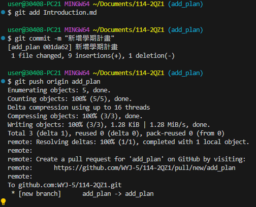
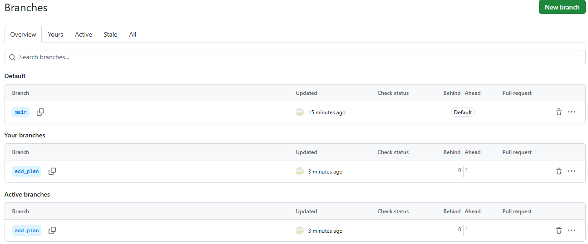
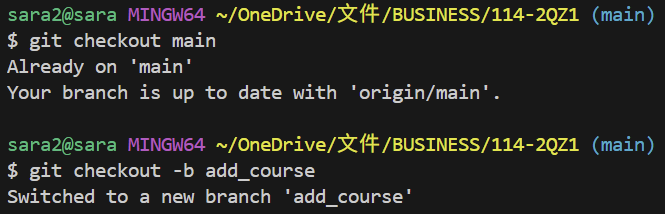
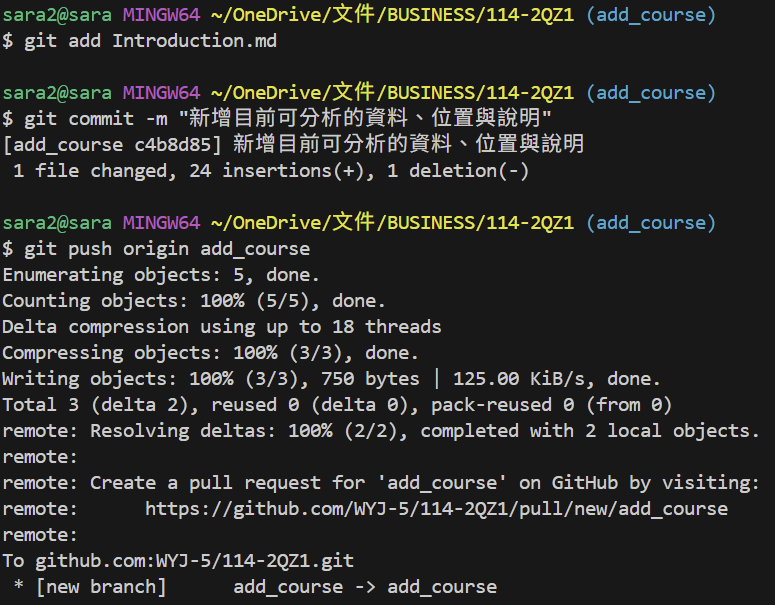
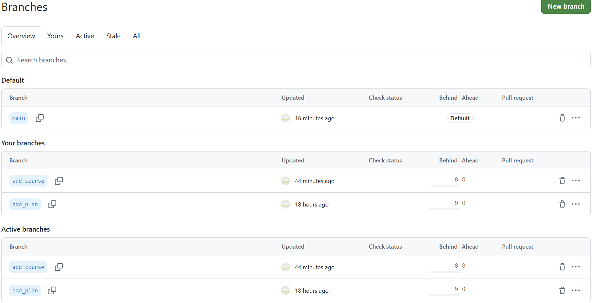
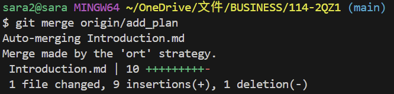
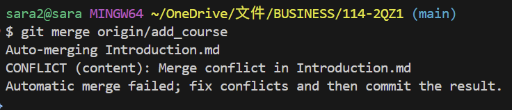
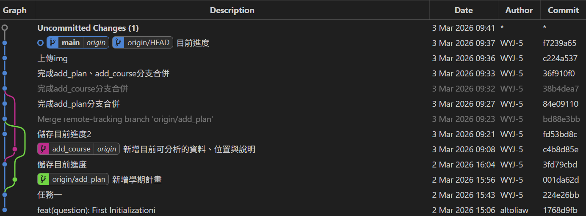

# 第1次隨堂題目-隨堂-QZ1
>
>學號：112111102
> 
>姓名：吳映潔
>

1. 

Ans: 

#### 任務一：

建立Introduction.md，撰寫自我介紹，並上傳至GitHub。

執行截圖： 

圖 1-1：在本地端執行git add、git commit、git push，將Introduction.md送到GitHub上。

圖 1-2：Introduction.md成功推送到GitHub。

#### 任務二：

1. 建立分支 add_plan

在add_plan分支中編輯Introduction.md，新增學期預習與複習計畫的部分。

圖 2-1-1：使用git checkout -b建立並切換至add_plan分支中。

圖 2-1-2：將新增學期計畫內容的Introduction.md進行Commit和Push。

圖 2-1-3：於GitHub網頁端查看分支。

2. 建立分支 add_course

在add_course分支中編輯Introduction.md，新增目前可分析的資料、位置與說明的部分。

圖 2-2-1：切換回main分支後，建立新分支add_course。

圖 2-2-2：將新增目前可分析的資料、位置與說明內容的Introduction.md進行Commit和Push。

圖 2-2-3：於GitHub網頁端查看分支。

#### 任務三：

回到main分支，依序合併上述兩條分支，並觀察會發生什麼事。

我的觀察：

1. 合併add_plan：利用git merge origin/add_plan，完成了合併動作。

   圖 3-1：合併第一條分支add_plan，完成合併。

   

2. 合併add_course：發生了Merge Conflict（合併衝突）。

   因為add_plan與add_course都是基於同一個main分支切出的，都在Introduction.md的同一個位置新增了內容，電腦無法自動判斷哪一段文字該排在前面，所以要我們自行改動一些部分才能繼續合併。

   解決衝突方式：
   
   將Introduction.md，移除Git產生的衝突標記（<<<<<<<、=======、>>>>>>>），然後重新執行git add、git commit、git push完成合併。

   圖 3-2：合併第二條分支時噴出 CONFLICT 警告，顯示自動合併失敗。

   

   

圖 3-3：Git Graph可以看main的分支以及合併路徑。

